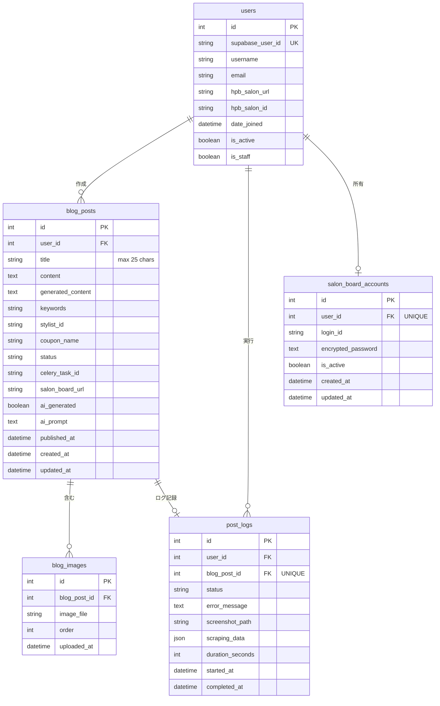

# 06. データベース設計書 (Database Schema Design)

## 1. 概要
本ドキュメントは、HPBブログ自動化システムのデータベーススキーマを定義します。
PostgreSQL 16を使用し、Django ORMでモデルを実装します。

---

## 2. ER図



---

## 3. テーブル定義

### 3.1 users（ユーザー）

Djangoの`AbstractUser`を拡張したカスタムユーザーモデル。

```python
# apps/accounts/models.py
from django.contrib.auth.models import AbstractUser
from django.db import models

class User(AbstractUser):
    """
    Custom user model for Supabase integration and HPB settings
    """
    # Supabase integration
    supabase_user_id = models.CharField(
        max_length=255,
        unique=True,
        null=True,
        blank=True,
        db_index=True,
        help_text='User ID from Supabase authentication system'
    )

    # HPB (Hot Pepper Beauty) settings
    hpb_salon_url = models.URLField(
        max_length=500,
        blank=True,
        help_text='HPB salon top page URL'
    )
    hpb_salon_id = models.CharField(
        max_length=20,
        blank=True,
        db_index=True,
        help_text='Extracted salon ID (e.g., H000123456)'
    )

    class Meta:
        db_table = 'accounts_user'
        indexes = [
            models.Index(fields=['supabase_user_id']),
            models.Index(fields=['hpb_salon_id']),
            models.Index(fields=['date_joined']),
        ]
```

**カラム詳細**:

| カラム名 | 型 | 制約 | 説明 |
|---------|-----|------|------|
| id | INTEGER | PRIMARY KEY | 自動採番ID |
| supabase_user_id | VARCHAR(255) | UNIQUE, NULL可 | Supabase認証UID |
| username | VARCHAR(150) | UNIQUE | ユーザー名（Django標準） |
| email | VARCHAR(254) | | メールアドレス（Django標準） |
| password | VARCHAR(128) | | パスワードハッシュ（Django標準） |
| hpb_salon_url | VARCHAR(500) | | HPBサロンURL |
| hpb_salon_id | VARCHAR(20) | INDEX | サロンID（自動抽出） |
| is_active | BOOLEAN | DEFAULT TRUE | アカウント有効フラグ |
| is_staff | BOOLEAN | DEFAULT FALSE | 管理者フラグ |
| date_joined | TIMESTAMP | | 登録日時 |
| last_login | TIMESTAMP | NULL可 | 最終ログイン |

---

### 3.2 blog_posts（ブログ投稿）

```python
# apps/blog/models.py
class BlogPost(models.Model):
    """
    Blog post model
    """
    STATUS_CHOICES = [
        ('draft', 'Draft'),
        ('generating', 'AI Generating'),
        ('selecting', 'Selecting Article'),  # ユーザーが3案から選択中
        ('ready', 'Ready to Publish'),
        ('publishing', 'Publishing'),
        ('published', 'Published'),
        ('failed', 'Failed'),
    ]

    user = models.ForeignKey(
        settings.AUTH_USER_MODEL,
        on_delete=models.CASCADE,
        related_name='blog_posts'
    )
    title = models.CharField(max_length=25, blank=True, default='')
    content = models.TextField(blank=True, default='')
    generated_content = models.TextField(blank=True)
    generated_variations = models.JSONField(
        default=list,
        blank=True,
        help_text='AI-generated article variations for selection'
    )  # AI生成した3案を保存
    status = models.CharField(
        max_length=20,
        choices=STATUS_CHOICES,
        default='draft',
        db_index=True
    )

    # AI generation
    ai_prompt = models.TextField(blank=True)
    keywords = models.CharField(max_length=200, blank=True)
    ai_generated = models.BooleanField(default=False)

    # SALON BOARD parameters
    stylist_id = models.CharField(max_length=20, blank=True)
    coupon_name = models.CharField(max_length=100, blank=True)
    celery_task_id = models.CharField(max_length=255, blank=True, db_index=True)

    # Result
    salon_board_url = models.URLField(blank=True, max_length=500)
    published_at = models.DateTimeField(null=True, blank=True)

    # Timestamps
    created_at = models.DateTimeField(auto_now_add=True)
    updated_at = models.DateTimeField(auto_now=True)

    class Meta:
        db_table = 'blog_posts'
        ordering = ['-created_at']
        indexes = [
            models.Index(fields=['user', '-created_at']),
            models.Index(fields=['status']),
            models.Index(fields=['celery_task_id']),
            models.Index(fields=['-published_at']),
        ]
```

**カラム詳細**:

| カラム名 | 型 | 制約 | 説明 |
|---------|-----|------|------|
| id | INTEGER | PRIMARY KEY | 自動採番ID |
| user_id | INTEGER | FOREIGN KEY | ユーザーID |
| title | VARCHAR(25) | DEFAULT '' | タイトル（25文字以内） |
| content | TEXT | DEFAULT '' | 本文 |
| generated_content | TEXT | | AI生成元本文（バックアップ） |
| generated_variations | JSONB | DEFAULT [] | AI生成した3案のバリエーション |
| keywords | VARCHAR(200) | | キーワード |
| ai_prompt | TEXT | | AIプロンプト |
| ai_generated | BOOLEAN | DEFAULT FALSE | AI生成フラグ |
| stylist_id | VARCHAR(20) | | スタイリストID（T番号） |
| coupon_name | VARCHAR(100) | | クーポン名 |
| status | VARCHAR(20) | INDEX | ステータス |
| celery_task_id | VARCHAR(255) | INDEX | タスクID |
| salon_board_url | VARCHAR(500) | | 投稿URL |
| published_at | TIMESTAMP | NULL可 | 投稿日時 |
| created_at | TIMESTAMP | | 作成日時 |
| updated_at | TIMESTAMP | | 更新日時 |

**generated_variations JSONフォーマット**:
```json
[
  {
    "id": 1,
    "title": "記事タイトル案1",
    "content": "記事本文案1（画像プレースホルダー含む）"
  },
  {
    "id": 2,
    "title": "記事タイトル案2",
    "content": "記事本文案2（画像プレースホルダー含む）"
  },
  {
    "id": 3,
    "title": "記事タイトル案3",
    "content": "記事本文案3（画像プレースホルダー含む）"
  }
]
```

---

### 3.3 blog_images（ブログ画像）

```python
# apps/blog/models.py
class BlogImage(models.Model):
    """
    Blog image model
    """
    blog_post = models.ForeignKey(
        BlogPost,
        on_delete=models.CASCADE,
        related_name='images'
    )
    image_file = models.ImageField(upload_to='blog_images/%Y/%m/%d/')
    order = models.PositiveSmallIntegerField(default=0)
    uploaded_at = models.DateTimeField(auto_now_add=True)

    class Meta:
        db_table = 'blog_images'
        ordering = ['blog_post', 'order']
        unique_together = [['blog_post', 'order']]
        indexes = [
            models.Index(fields=['blog_post', 'order']),
        ]
```

**カラム詳細**:

| カラム名 | 型 | 制約 | 説明 |
|---------|-----|------|------|
| id | INTEGER | PRIMARY KEY | 自動採番ID |
| blog_post_id | INTEGER | FOREIGN KEY | ブログ投稿ID |
| image_file | VARCHAR(255) | NOT NULL | 画像ファイルパス |
| order | SMALLINT | NOT NULL | 表示順序（0始まり） |
| uploaded_at | TIMESTAMP | | アップロード日時 |

**制約**:
- UNIQUE (blog_post_id, order)

---

### 3.4 post_logs（投稿ログ）

```python
# apps/blog/models.py
class PostLog(models.Model):
    """
    Post execution log model
    """
    STATUS_CHOICES = [
        ('success', 'Success'),
        ('failed', 'Failed'),
    ]

    user = models.ForeignKey(
        settings.AUTH_USER_MODEL,
        on_delete=models.CASCADE,
        related_name='post_logs'
    )
    blog_post = models.OneToOneField(
        BlogPost,
        on_delete=models.SET_NULL,
        null=True,
        blank=True,
        related_name='log'
    )
    status = models.CharField(max_length=20, choices=STATUS_CHOICES, db_index=True)
    error_message = models.TextField(blank=True)
    screenshot_path = models.CharField(max_length=500, blank=True)
    scraping_data = models.JSONField(default=dict, blank=True)
    duration_seconds = models.IntegerField(default=0)
    started_at = models.DateTimeField()
    completed_at = models.DateTimeField(null=True, blank=True)

    class Meta:
        db_table = 'post_logs'
        ordering = ['-started_at']
        indexes = [
            models.Index(fields=['user', '-started_at']),
            models.Index(fields=['status']),
            models.Index(fields=['-completed_at']),
        ]
```

**カラム詳細**:

| カラム名 | 型 | 制約 | 説明 |
|---------|-----|------|------|
| id | INTEGER | PRIMARY KEY | 自動採番ID |
| user_id | INTEGER | FOREIGN KEY | ユーザーID |
| blog_post_id | INTEGER | FOREIGN KEY, UNIQUE | ブログ投稿ID |
| status | VARCHAR(20) | INDEX | 実行結果 |
| error_message | TEXT | | エラー内容 |
| screenshot_path | VARCHAR(500) | | スクリーンショット |
| scraping_data | JSONB | | スクレイピングデータ |
| duration_seconds | INTEGER | | 処理時間（秒） |
| started_at | TIMESTAMP | | 開始日時 |
| completed_at | TIMESTAMP | NULL可 | 完了日時 |

---

### 3.5 salon_board_accounts（SALON BOARDアカウント）

```python
# apps/blog/models.py
class SALONBoardAccount(models.Model):
    """
    SALON BOARD account information (encrypted)
    """
    user = models.OneToOneField(
        settings.AUTH_USER_MODEL,
        on_delete=models.CASCADE,
        related_name='salon_board_account'
    )
    login_id = models.CharField(max_length=255)
    encrypted_password = models.TextField()
    is_active = models.BooleanField(default=True)
    created_at = models.DateTimeField(auto_now_add=True)
    updated_at = models.DateTimeField(auto_now=True)

    class Meta:
        db_table = 'salon_board_accounts'

    def get_credentials(self) -> tuple:
        """Get decrypted credentials"""
        from cryptography.fernet import Fernet
        fernet = Fernet(settings.ENCRYPTION_KEY.encode())
        password = fernet.decrypt(self.encrypted_password.encode()).decode()
        return self.login_id, password

    def set_password(self, password: str):
        """Encrypt and set password"""
        from cryptography.fernet import Fernet
        fernet = Fernet(settings.ENCRYPTION_KEY.encode())
        self.encrypted_password = fernet.encrypt(password.encode()).decode()
```

**カラム詳細**:

| カラム名 | 型 | 制約 | 説明 |
|---------|-----|------|------|
| id | INTEGER | PRIMARY KEY | 自動採番ID |
| user_id | INTEGER | FOREIGN KEY, UNIQUE | ユーザーID |
| login_id | VARCHAR(255) | NOT NULL | ログインID |
| encrypted_password | TEXT | NOT NULL | 暗号化パスワード |
| is_active | BOOLEAN | DEFAULT TRUE | 有効フラグ |
| created_at | TIMESTAMP | | 作成日時 |
| updated_at | TIMESTAMP | | 更新日時 |

---

## 4. リレーション詳細

### 4.1 users → blog_posts
- **関係**: 1対多
- **ON DELETE**: CASCADE（ユーザー削除時は投稿も削除）
- **related_name**: `blog_posts`

### 4.2 blog_posts → blog_images
- **関係**: 1対多
- **ON DELETE**: CASCADE（投稿削除時は画像も削除）
- **related_name**: `images`

### 4.3 users → post_logs
- **関係**: 1対多
- **ON DELETE**: CASCADE（ユーザー削除時はログも削除）
- **related_name**: `post_logs`

### 4.4 blog_posts → post_logs
- **関係**: 1対1
- **ON DELETE**: SET NULL（投稿削除時はログは残す）
- **related_name**: `log`

### 4.5 users → salon_board_accounts
- **関係**: 1対1
- **ON DELETE**: CASCADE（ユーザー削除時はアカウントも削除）
- **related_name**: `salon_board_account`

---

## 5. Django Celeryテーブル

### 5.1 django_celery_results_taskresult
Celeryタスク結果を保存（`django-celery-results`により自動生成）

### 5.2 django_celery_beat_periodictask
定期タスク設定（`django-celery-beat`により自動生成）

---

## 6. マイグレーション戦略

### 6.1 マイグレーション実行

```bash
# 1. マイグレーション作成
python manage.py makemigrations accounts
python manage.py makemigrations blog

# 2. マイグレーション適用
python manage.py migrate
```

---

## 7. インデックス最適化

### 7.1 複合インデックス

```python
# blog_posts テーブル
indexes = [
    models.Index(fields=['user', '-created_at']),  # ユーザーの投稿一覧
    models.Index(fields=['status']),               # ステータス別フィルタ
    models.Index(fields=['celery_task_id']),       # タスクID検索
]

# post_logs テーブル
indexes = [
    models.Index(fields=['user', '-started_at']),  # ユーザーのログ一覧
    models.Index(fields=['status']),               # ステータス別フィルタ
]
```

### 7.2 クエリ最適化例

```python
# ユーザーの最新投稿を取得（インデックス利用）
recent_posts = BlogPost.objects.filter(
    user=user
).select_related('user').prefetch_related('images').order_by('-created_at')[:10]

# 処理中の投稿を検索（インデックス利用）
processing_posts = BlogPost.objects.filter(status='processing')

# ユーザーの投稿履歴とログを取得（JOIN最適化）
posts_with_logs = BlogPost.objects.filter(
    user=user
).select_related('log').order_by('-created_at')
```

---

## 8. データ整合性制約

### 8.1 アプリケーションレベル制約

```python
# apps/blog/models.py
from django.core.exceptions import ValidationError

class BlogPost(models.Model):
    def clean(self):
        """バリデーション"""
        # タイトルは25文字以内
        if self.title and len(self.title) > 25:
            raise ValidationError({'title': 'Title must be 25 characters or less'})

        # 本文は必須（draft/generating/selecting以外）
        if self.status not in ['draft', 'generating', 'selecting'] and not self.content:
            raise ValidationError({'content': 'Content is required'})
```

---

## 9. データ保持ポリシー

| テーブル | 保持期間 | 削除方法 |
|---------|---------|---------|
| users | 無期限 | 手動削除のみ |
| blog_posts | 無期限 | ユーザーが削除可能 |
| blog_images | 投稿と同期 | CASCADE削除 |
| post_logs | 現状未設定 | 手動削除または将来のバッチで対応 |
| celery results | 7日 | Celeryの自動クリーンアップ |

---

## 10. セキュリティ考慮事項

### 10.1 暗号化フィールド

```python
# apps/blog/models.py
class SALONBoardAccount(models.Model):
    def set_password(self, password: str):
        from cryptography.fernet import Fernet
        fernet = Fernet(settings.ENCRYPTION_KEY.encode())
        self.encrypted_password = fernet.encrypt(password.encode()).decode()

    def get_credentials(self) -> tuple:
        from cryptography.fernet import Fernet
        fernet = Fernet(settings.ENCRYPTION_KEY.encode())
        password = fernet.decrypt(self.encrypted_password.encode()).decode()
        return self.login_id, password
```

### 10.2 SQLインジェクション対策
Django ORMを使用することで自動的に対策されます。

---

## 11. まとめ

このデータベース設計により：
- **正規化**: 適切な正規化でデータ重複を防止
- **パフォーマンス**: 適切なインデックスで高速クエリ
- **拡張性**: 将来の機能追加に対応可能な柔軟な設計
- **セキュリティ**: 認証情報の暗号化、SQLインジェクション対策
- **保守性**: ログ管理とクリーンアップによる肥大化防止

---

**作成日**: 2025年1月
**最終更新**: 2025年11月
**ステータス**: 実装完了・ドキュメント更新
