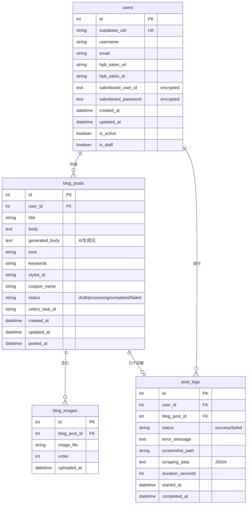

# 06. データベース設計書 (Database Schema Design)

## 1. 概要
本ドキュメントは、HPBブログ自動化システムのデータベーススキーマを定義します。
PostgreSQL 16を使用し、Django ORMでモデルを実装します。

---

## 2. ER図



---

## 3. テーブル定義

### 3.1 users（ユーザー）

Djangoの`AbstractUser`を拡張したカスタムユーザーモデル。

```python
# apps/accounts/models.py
from django.contrib.auth.models import AbstractUser
from django.db import models

class User(AbstractUser):
    """
    拡張ユーザーモデル
    """
    # Supabase認証
    supabase_uid = models.CharField(
        max_length=255,
        unique=True,
        null=True,
        blank=True,
        db_index=True,
        help_text="SupabaseのユーザーUID"
    )

    # HPB設定
    hpb_salon_url = models.URLField(
        max_length=500,
        blank=True,
        help_text="HPBサロンTOPページURL (例: https://beauty.hotpepper.jp/slnH000xxxxx/)"
    )

    hpb_salon_id = models.CharField(
        max_length=20,
        blank=True,
        db_index=True,
        help_text="抽出されたサロンID (例: H000123456)"
    )

    # SALON BOARD認証情報（暗号化）
    salonboard_user_id = models.TextField(
        blank=True,
        help_text="SALON BOARDログインID（暗号化済み）"
    )

    salonboard_password = models.TextField(
        blank=True,
        help_text="SALON BOARDパスワード（暗号化済み）"
    )

    # タイムスタンプ
    created_at = models.DateTimeField(auto_now_add=True)
    updated_at = models.DateTimeField(auto_now=True)

    class Meta:
        db_table = 'users'
        verbose_name = 'ユーザー'
        verbose_name_plural = 'ユーザー'
        indexes = [
            models.Index(fields=['supabase_uid']),
            models.Index(fields=['hpb_salon_id']),
            models.Index(fields=['created_at']),
        ]

    def __str__(self):
        return self.username

    def save_credentials(self, login_id: str, password: str):
        """
        SALON BOARD認証情報を暗号化して保存
        """
        from apps.accounts.utils import encrypt_credential
        self.salonboard_user_id = encrypt_credential(login_id)
        self.salonboard_password = encrypt_credential(password)
        self.save()

    def get_credentials(self) -> tuple:
        """
        SALON BOARD認証情報を復号化して取得

        Returns:
            tuple: (login_id, password)
        """
        from apps.accounts.utils import decrypt_credential
        login_id = decrypt_credential(self.salonboard_user_id)
        password = decrypt_credential(self.salonboard_password)
        return login_id, password
```

**カラム詳細**:

| カラム名 | 型 | 制約 | 説明 |
|---------|-----|------|------|
| id | INTEGER | PRIMARY KEY | 自動採番ID |
| supabase_uid | VARCHAR(255) | UNIQUE, NULL可 | Supabase認証UID |
| username | VARCHAR(150) | UNIQUE | ユーザー名（Django標準） |
| email | VARCHAR(254) | | メールアドレス（Django標準） |
| password | VARCHAR(128) | | パスワードハッシュ（Django標準） |
| hpb_salon_url | VARCHAR(500) | | HPBサロンURL |
| hpb_salon_id | VARCHAR(20) | INDEX | サロンID（抽出済み） |
| salonboard_user_id | TEXT | | SALON BOARDログインID（暗号化） |
| salonboard_password | TEXT | | SALON BOARDパスワード（暗号化） |
| is_active | BOOLEAN | DEFAULT TRUE | アカウント有効フラグ |
| is_staff | BOOLEAN | DEFAULT FALSE | 管理者フラグ |
| created_at | TIMESTAMP | | 作成日時 |
| updated_at | TIMESTAMP | | 更新日時 |

**インデックス**:
- `supabase_uid` (UNIQUE)
- `hpb_salon_id`
- `created_at`

---

### 3.2 blog_posts（ブログ投稿）

```python
# apps/blog/models.py
from django.db import models
from django.conf import settings

class BlogPost(models.Model):
    """
    ブログ投稿モデル
    """

    STATUS_CHOICES = [
        ('draft', '下書き'),
        ('processing', '処理中'),
        ('completed', '完了'),
        ('failed', '失敗'),
    ]

    # 関連
    user = models.ForeignKey(
        settings.AUTH_USER_MODEL,
        on_delete=models.CASCADE,
        related_name='blog_posts',
        help_text="投稿者"
    )

    # コンテンツ
    title = models.CharField(
        max_length=25,
        help_text="ブログタイトル（25文字以内）"
    )

    body = models.TextField(
        help_text="最終的な本文（画像プレースホルダー含む）"
    )

    generated_body = models.TextField(
        blank=True,
        help_text="AI生成された元の本文（バックアップ用）"
    )

    # 生成パラメータ
    tone = models.CharField(
        max_length=50,
        blank=True,
        help_text="トーン＆マナー"
    )

    keywords = models.CharField(
        max_length=200,
        blank=True,
        help_text="キーワード"
    )

    # SALON BOARD投稿パラメータ
    stylist_id = models.CharField(
        max_length=20,
        blank=True,
        help_text="スタイリストID (T番号)"
    )

    coupon_name = models.CharField(
        max_length=100,
        blank=True,
        help_text="クーポン名"
    )

    # ステータス管理
    status = models.CharField(
        max_length=20,
        choices=STATUS_CHOICES,
        default='draft',
        db_index=True,
        help_text="投稿ステータス"
    )

    celery_task_id = models.CharField(
        max_length=255,
        blank=True,
        db_index=True,
        help_text="Celeryタスクid"
    )

    # タイムスタンプ
    created_at = models.DateTimeField(auto_now_add=True)
    updated_at = models.DateTimeField(auto_now=True)
    posted_at = models.DateTimeField(
        null=True,
        blank=True,
        help_text="SALON BOARDへの投稿完了日時"
    )

    class Meta:
        db_table = 'blog_posts'
        verbose_name = 'ブログ投稿'
        verbose_name_plural = 'ブログ投稿'
        ordering = ['-created_at']
        indexes = [
            models.Index(fields=['user', '-created_at']),
            models.Index(fields=['status']),
            models.Index(fields=['celery_task_id']),
            models.Index(fields=['-posted_at']),
        ]

    def __str__(self):
        return f"{self.title} ({self.user.username})"

    def get_image_count(self) -> int:
        """画像数を取得"""
        return self.images.count()

    def is_processable(self) -> bool:
        """投稿処理可能か判定"""
        return self.status in ['draft'] and self.images.exists()
```

**カラム詳細**:

| カラム名 | 型 | 制約 | 説明 |
|---------|-----|------|------|
| id | INTEGER | PRIMARY KEY | 自動採番ID |
| user_id | INTEGER | FOREIGN KEY | ユーザーID |
| title | VARCHAR(25) | NOT NULL | タイトル |
| body | TEXT | NOT NULL | 本文 |
| generated_body | TEXT | | AI生成元本文 |
| tone | VARCHAR(50) | | トーン |
| keywords | VARCHAR(200) | | キーワード |
| stylist_id | VARCHAR(20) | | スタイリストID |
| coupon_name | VARCHAR(100) | | クーポン名 |
| status | VARCHAR(20) | INDEX | ステータス |
| celery_task_id | VARCHAR(255) | INDEX | タスクID |
| created_at | TIMESTAMP | | 作成日時 |
| updated_at | TIMESTAMP | | 更新日時 |
| posted_at | TIMESTAMP | NULL可 | 投稿日時 |

**インデックス**:
- `(user_id, created_at DESC)`（複合）
- `status`
- `celery_task_id`
- `posted_at DESC`

---

### 3.3 blog_images（ブログ画像）

```python
# apps/blog/models.py
class BlogImage(models.Model):
    """
    ブログ画像モデル
    """

    blog_post = models.ForeignKey(
        BlogPost,
        on_delete=models.CASCADE,
        related_name='images',
        help_text="関連ブログ投稿"
    )

    image_file = models.ImageField(
        upload_to='blog_images/%Y/%m/%d/',
        help_text="画像ファイル"
    )

    order = models.PositiveSmallIntegerField(
        default=0,
        help_text="表示順序（0始まり）"
    )

    uploaded_at = models.DateTimeField(auto_now_add=True)

    class Meta:
        db_table = 'blog_images'
        verbose_name = 'ブログ画像'
        verbose_name_plural = 'ブログ画像'
        ordering = ['blog_post', 'order']
        unique_together = [['blog_post', 'order']]
        indexes = [
            models.Index(fields=['blog_post', 'order']),
        ]

    def __str__(self):
        return f"Image {self.order+1} for {self.blog_post.title}"

    @property
    def image_url(self) -> str:
        """画像URLを取得"""
        if self.image_file:
            return self.image_file.url
        return ""

    @property
    def file_path(self) -> str:
        """ファイルパスを取得"""
        if self.image_file:
            return self.image_file.path
        return ""
```

**カラム詳細**:

| カラム名 | 型 | 制約 | 説明 |
|---------|-----|------|------|
| id | INTEGER | PRIMARY KEY | 自動採番ID |
| blog_post_id | INTEGER | FOREIGN KEY | ブログ投稿ID |
| image_file | VARCHAR(255) | NOT NULL | 画像ファイルパス |
| order | SMALLINT | NOT NULL | 表示順序 |
| uploaded_at | TIMESTAMP | | アップロード日時 |

**制約**:
- UNIQUE (blog_post_id, order)

**インデックス**:
- `(blog_post_id, order)`（複合）

---

### 3.4 post_logs（投稿ログ）

```python
# apps/blog/models.py
class PostLog(models.Model):
    """
    投稿ログモデル
    """

    STATUS_CHOICES = [
        ('success', '成功'),
        ('failed', '失敗'),
    ]

    # 関連
    user = models.ForeignKey(
        settings.AUTH_USER_MODEL,
        on_delete=models.CASCADE,
        related_name='post_logs',
        help_text="実行ユーザー"
    )

    blog_post = models.OneToOneField(
        BlogPost,
        on_delete=models.SET_NULL,
        null=True,
        blank=True,
        related_name='log',
        help_text="関連ブログ投稿"
    )

    # ステータス
    status = models.CharField(
        max_length=20,
        choices=STATUS_CHOICES,
        db_index=True,
        help_text="実行結果"
    )

    error_message = models.TextField(
        blank=True,
        help_text="エラーメッセージ"
    )

    # 記録データ
    screenshot_path = models.CharField(
        max_length=500,
        blank=True,
        help_text="完了スクリーンショットパス"
    )

    scraping_data = models.JSONField(
        default=dict,
        blank=True,
        help_text="スクレイピングで取得したデータ（JSON）"
    )

    duration_seconds = models.IntegerField(
        default=0,
        help_text="処理時間（秒）"
    )

    # タイムスタンプ
    started_at = models.DateTimeField(
        help_text="処理開始日時"
    )

    completed_at = models.DateTimeField(
        null=True,
        blank=True,
        help_text="処理完了日時"
    )

    class Meta:
        db_table = 'post_logs'
        verbose_name = '投稿ログ'
        verbose_name_plural = '投稿ログ'
        ordering = ['-started_at']
        indexes = [
            models.Index(fields=['user', '-started_at']),
            models.Index(fields=['status']),
            models.Index(fields=['-completed_at']),
        ]

    def __str__(self):
        return f"Log {self.id} - {self.status} ({self.user.username})"

    def calculate_duration(self):
        """処理時間を計算"""
        if self.completed_at and self.started_at:
            delta = self.completed_at - self.started_at
            self.duration_seconds = int(delta.total_seconds())
            self.save(update_fields=['duration_seconds'])
```

**カラム詳細**:

| カラム名 | 型 | 制約 | 説明 |
|---------|-----|------|------|
| id | INTEGER | PRIMARY KEY | 自動採番ID |
| user_id | INTEGER | FOREIGN KEY | ユーザーID |
| blog_post_id | INTEGER | FOREIGN KEY, UNIQUE | ブログ投稿ID |
| status | VARCHAR(20) | INDEX | 実行結果 |
| error_message | TEXT | | エラー内容 |
| screenshot_path | VARCHAR(500) | | スクリーンショット |
| scraping_data | JSONB | | スクレイピングデータ |
| duration_seconds | INTEGER | | 処理時間（秒） |
| started_at | TIMESTAMP | | 開始日時 |
| completed_at | TIMESTAMP | NULL可 | 完了日時 |

**インデックス**:
- `(user_id, started_at DESC)`（複合）
- `status`
- `completed_at DESC`

---

## 4. リレーション詳細

### 4.1 users → blog_posts
- **関係**: 1対多
- **ON DELETE**: CASCADE（ユーザー削除時は投稿も削除）
- **related_name**: `blog_posts`

### 4.2 blog_posts → blog_images
- **関係**: 1対多
- **ON DELETE**: CASCADE（投稿削除時は画像も削除）
- **related_name**: `images`

### 4.3 users → post_logs
- **関係**: 1対多
- **ON DELETE**: CASCADE（ユーザー削除時はログも削除）
- **related_name**: `post_logs`

### 4.4 blog_posts → post_logs
- **関係**: 1対1
- **ON DELETE**: SET NULL（投稿削除時はログは残す）
- **related_name**: `log`

---

## 5. Django Celeryテーブル

### 5.1 django_celery_results_taskresult

Celeryタスク結果を保存（`django-celery-results`により自動生成）

```sql
CREATE TABLE django_celery_results_taskresult (
    id INTEGER PRIMARY KEY,
    task_id VARCHAR(255) UNIQUE NOT NULL,
    status VARCHAR(50),
    content_type VARCHAR(128),
    content_encoding VARCHAR(64),
    result TEXT,
    date_done TIMESTAMP,
    traceback TEXT,
    meta TEXT
);

CREATE INDEX idx_taskresult_task_id ON django_celery_results_taskresult(task_id);
CREATE INDEX idx_taskresult_status ON django_celery_results_taskresult(status);
CREATE INDEX idx_taskresult_date_done ON django_celery_results_taskresult(date_done);
```

### 5.2 django_celery_beat_periodictask

定期タスク設定（`django-celery-beat`により自動生成）

```sql
CREATE TABLE django_celery_beat_periodictask (
    id INTEGER PRIMARY KEY,
    name VARCHAR(200) UNIQUE NOT NULL,
    task VARCHAR(200) NOT NULL,
    args TEXT,
    kwargs TEXT,
    queue VARCHAR(200),
    enabled BOOLEAN DEFAULT TRUE,
    last_run_at TIMESTAMP,
    total_run_count INTEGER DEFAULT 0,
    date_changed TIMESTAMP,
    description TEXT
);
```

---

## 6. マイグレーション戦略

### 6.1 初期マイグレーション

```bash
# 1. accountsアプリのマイグレーション作成
python manage.py makemigrations accounts

# 2. blogアプリのマイグレーション作成
python manage.py makemigrations blog

# 3. マイグレーション適用
python manage.py migrate
```

### 6.2 マイグレーションファイル例

```python
# apps/accounts/migrations/0001_initial.py
from django.db import migrations, models
import django.contrib.auth.models

class Migration(migrations.Migration):
    initial = True

    dependencies = [
        ('auth', '0012_alter_user_first_name_max_length'),
    ]

    operations = [
        migrations.CreateModel(
            name='User',
            fields=[
                ('id', models.BigAutoField(primary_key=True)),
                ('password', models.CharField(max_length=128)),
                ('last_login', models.DateTimeField(blank=True, null=True)),
                ('is_superuser', models.BooleanField(default=False)),
                ('username', models.CharField(max_length=150, unique=True)),
                ('email', models.EmailField(max_length=254)),
                # ... その他のフィールド
                ('supabase_uid', models.CharField(max_length=255, unique=True, null=True)),
                ('hpb_salon_url', models.URLField(max_length=500, blank=True)),
                # ... カスタムフィールド
            ],
            options={
                'db_table': 'users',
            },
            managers=[
                ('objects', django.contrib.auth.models.UserManager()),
            ],
        ),
    ]
```

---

## 7. インデックス最適化

### 7.1 複合インデックス

**目的**: よく使われるクエリを高速化

```python
# users テーブル
indexes = [
    models.Index(fields=['supabase_uid']),
    models.Index(fields=['hpb_salon_id']),
]

# blog_posts テーブル
indexes = [
    models.Index(fields=['user', '-created_at']),  # ユーザーの投稿一覧
    models.Index(fields=['status']),               # ステータス別フィルタ
    models.Index(fields=['celery_task_id']),       # タスクID検索
]

# post_logs テーブル
indexes = [
    models.Index(fields=['user', '-started_at']),  # ユーザーのログ一覧
    models.Index(fields=['status']),               # ステータス別フィルタ
]
```

### 7.2 クエリ最適化例

```python
# ユーザーの最新投稿を取得（インデックス利用）
recent_posts = BlogPost.objects.filter(
    user=user
).select_related('user').prefetch_related('images').order_by('-created_at')[:10]

# 処理中の投稿を検索（インデックス利用）
processing_posts = BlogPost.objects.filter(status='processing')

# ユーザーの投稿履歴とログを取得（JOIN最適化）
posts_with_logs = BlogPost.objects.filter(
    user=user
).select_related('log').order_by('-created_at')
```

---

## 8. データ整合性制約

### 8.1 アプリケーションレベル制約

```python
# apps/blog/models.py
from django.core.exceptions import ValidationError

class BlogPost(models.Model):
    # ...

    def clean(self):
        """バリデーション"""
        # タイトルは25文字以内
        if len(self.title) > 25:
            raise ValidationError({'title': 'タイトルは25文字以内にしてください'})

        # 本文は必須
        if not self.body:
            raise ValidationError({'body': '本文は必須です'})

        # 処理中は1ユーザー1件まで
        if self.status == 'processing':
            existing = BlogPost.objects.filter(
                user=self.user,
                status='processing'
            ).exclude(pk=self.pk).exists()

            if existing:
                raise ValidationError('すでに処理中の投稿があります')
```

### 8.2 データベースレベル制約

```sql
-- blog_images の順序は0以上
ALTER TABLE blog_images ADD CONSTRAINT check_order_non_negative
CHECK (order >= 0);

-- post_logs の処理時間は0以上
ALTER TABLE post_logs ADD CONSTRAINT check_duration_non_negative
CHECK (duration_seconds >= 0);

-- blog_posts のタイトルは空文字列不可
ALTER TABLE blog_posts ADD CONSTRAINT check_title_not_empty
CHECK (length(title) > 0);
```

---

## 9. データ保持ポリシー

### 9.1 削除ポリシー

| テーブル | 保持期間 | 削除方法 |
|---------|---------|---------|
| users | 無期限 | 手動削除のみ |
| blog_posts | 無期限 | ユーザーが削除可能 |
| blog_images | 投稿と同期 | CASCADE削除 |
| post_logs | 6ヶ月 | 定期バッチ削除 |
| celery results | 7日 | Celeryの自動クリーンアップ |

### 9.2 定期クリーンアップタスク

```python
# apps/blog/tasks.py
from celery import shared_task
from datetime import timedelta
from django.utils import timezone

@shared_task
def cleanup_old_logs():
    """
    6ヶ月以上前のログを削除
    """
    cutoff_date = timezone.now() - timedelta(days=180)
    deleted_count, _ = PostLog.objects.filter(
        completed_at__lt=cutoff_date
    ).delete()

    logger.info(f"Deleted {deleted_count} old logs")
    return deleted_count

@shared_task
def cleanup_orphan_images():
    """
    関連投稿がない画像ファイルを削除
    """
    from pathlib import Path
    import os

    media_root = Path(settings.MEDIA_ROOT) / 'blog_images'
    deleted_files = []

    for image_file in media_root.rglob('*'):
        if image_file.is_file():
            relative_path = str(image_file.relative_to(settings.MEDIA_ROOT))
            if not BlogImage.objects.filter(image_file=relative_path).exists():
                os.remove(image_file)
                deleted_files.append(str(image_file))

    logger.info(f"Deleted {len(deleted_files)} orphan images")
    return deleted_files
```

### 9.3 Celery Beat設定

```python
# config/settings.py
from celery.schedules import crontab

CELERY_BEAT_SCHEDULE = {
    'cleanup-old-logs': {
        'task': 'apps.blog.tasks.cleanup_old_logs',
        'schedule': crontab(hour=3, minute=0),  # 毎日午前3時
    },
    'cleanup-orphan-images': {
        'task': 'apps.blog.tasks.cleanup_orphan_images',
        'schedule': crontab(hour=4, minute=0, day_of_week=0),  # 毎週日曜午前4時
    },
}
```

---

## 10. バックアップ戦略

### 10.1 PostgreSQLバックアップ

```bash
# 日次フルバックアップ
pg_dump -U blog_automation_user -d blog_automation_db -F c -f backup_$(date +%Y%m%d).dump

# リストア
pg_restore -U blog_automation_user -d blog_automation_db -c backup_20250120.dump
```

### 10.2 メディアファイルバックアップ

```bash
# rsyncでバックアップ
rsync -avz --delete /app/media/ /backup/media/

# または tar.gz圧縮
tar -czf media_backup_$(date +%Y%m%d).tar.gz /app/media/
```

---

## 11. パフォーマンスモニタリング

### 11.1 スロークエリ検出

```python
# config/settings.py
if DEBUG:
    LOGGING['loggers']['django.db.backends'] = {
        'level': 'DEBUG',
        'handlers': ['console'],
    }
```

### 11.2 django-debug-toolbarの使用

```python
# config/settings.py (開発環境のみ)
if DEBUG:
    INSTALLED_APPS += ['debug_toolbar']
    MIDDLEWARE += ['debug_toolbar.middleware.DebugToolbarMiddleware']
    INTERNAL_IPS = ['127.0.0.1']
```

---

## 12. セキュリティ考慮事項

### 12.1 暗号化フィールド

```python
# apps/accounts/utils.py
from cryptography.fernet import Fernet
from django.conf import settings

def get_fernet():
    return Fernet(settings.ENCRYPTION_KEY.encode())

def encrypt_credential(plain_text: str) -> str:
    if not plain_text:
        return ""
    f = get_fernet()
    return f.encrypt(plain_text.encode()).decode()

def decrypt_credential(encrypted_text: str) -> str:
    if not encrypted_text:
        return ""
    f = get_fernet()
    return f.decrypt(encrypted_text.encode()).decode()
```

### 12.2 SQLインジェクション対策

Django ORMを使用することで自動的に対策されます。

```python
# 安全（パラメータ化クエリ）
User.objects.filter(username=user_input)

# 危険（生SQLは避ける）
# User.objects.raw(f"SELECT * FROM users WHERE username = '{user_input}'")
```

---

## 13. まとめ

このデータベース設計により：
- **正規化**: 適切な正規化でデータ重複を防止
- **パフォーマンス**: 適切なインデックスで高速クエリ
- **拡張性**: 将来の機能追加に対応可能な柔軟な設計
- **セキュリティ**: 認証情報の暗号化、SQLインジェクション対策
- **保守性**: ログ管理とクリーンアップによる肥大化防止

次のステップでは、このスキーマを利用したAPIエンドポイント設計を行います。

---

**作成日**: 2025年1月
**最終更新**: 2025年1月
**ステータス**: 初版完成
