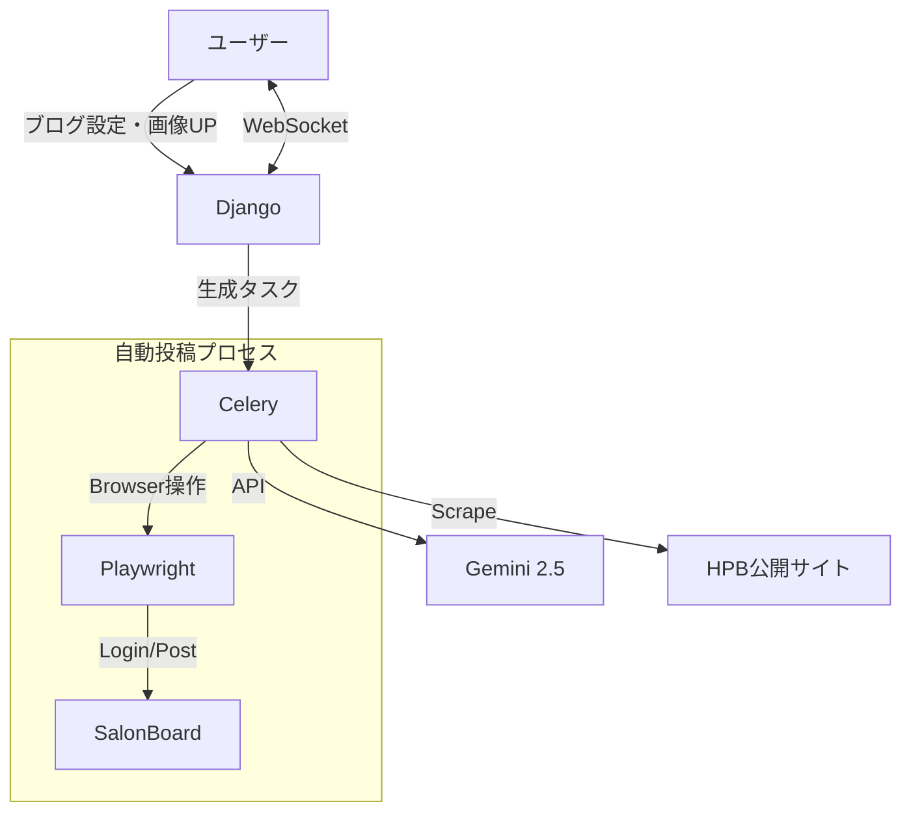

# 01. システム要件定義書 (System Requirements Specification)

## 1. プロジェクト概要

### 1.1 目的
美容室集客媒体「HotPepperBeauty (HPB)」のブログ投稿業務を自動化する。
生成AIによる記事作成、公開サイトからの情報取得（スクレイピング）、および SALON BOARD (CMS) へのブラウザ自動操作を組み合わせ、ユーザーの作業工数を極小化するクローズドWebアプリケーションを構築する。

### 1.2 システム形態
- **形態**: クローズドWebアプリケーション
- **デプロイ環境**: VPS (Docker / Docker Compose)
- **主要機能**: AI記事生成、画像管理、自動投稿、進捗通知

---

## 2. システムアーキテクチャ

### 2.1 技術スタック
| カテゴリ | 技術要素 | 詳細・選定理由 |
| --- | --- | --- |
| **Backend** | Python 3.12 / Django 5.x | メインフレームワーク。Channels使用。 |
| **Async Task** | Celery + Redis | Playwrightなどの重い処理を非同期実行。 |
| **Database** | PostgreSQL | ユーザー設定、投稿ログの保存。 |
| **Auth** | Supabase Auth | 認証・セッション管理（DBにはUIDのみ保持）。 |
| **Browser** | Playwright (Python) | SALON BOARD操作用ヘッドレスブラウザ。 |
| **AI** | Google Gemini 2.5 Flash | 高速かつ安価なテキスト生成モデル。 |
| **Scraping** | BeautifulSoup4 | 公開サイトからのマスタ情報取得。 |
| **Frontend** | Django Template + Tailwind | シンプルなサーバーサイドレンダリング。 |

### 2.2 データフロー図

---

## 3. 機能詳細要件

### 3.1 ユーザー設定管理

システム利用に必要な以下の情報を保存する。

1. **HPB サロントップページ URL**
    - 例: `https://beauty.hotpepper.jp/slnH000xxxxxx/`
    - **重要**: URL内の `slnH000xxxxxx` または `slnH000xxxxxx` 部分から **「サロンID (例: H000xxxxxx)」** を抽出して保存・利用する。これはサロンボード内での店舗特定に使用される。
2. **SALON BOARD ログインID / パスワード**
    - `cryptography` ライブラリ等を用いて**暗号化**してDBに保存すること。

### 3.2 マスタデータ取得 (Scraping Phase)

自動投稿時の紐付けキーを取得するため、公開サイトをスクレイピングする。

- **スタイリスト情報**:
    - URL: `{サロンTOP URL}/stylist/`
    - 取得項目: **スタイリストID (T番号)**, スタイリスト名
    - 抽出ロジック: 各スタイリスト詳細ページへのリンク `href` から `T000xxxxxx` を正規表現 `r'/stylist/(T\\d+)/'` で抽出。
- **クーポン情報**:
    - URL: `{サロンTOP URL}/coupon/` (全ページ走査)
    - 取得項目: **クーポン名**（文字列）
    - 用途: 投稿時の「部分一致検索」用キー。

### 3.3 ブログ生成フェーズ (AI Logic)

1. **入力**:
    - 画像: 最大4枚（ユーザーアップロード）。
    - キーワード: フリーテキスト。
    - トーン＆マナー: 選択式。
2. **生成プロンプト要件**:
    - **タイトル**: 25文字以内（厳守）。
    - **本文**: HTMLタグ込みで **800文字程度** を目安（最大1000文字制限への安全マージン）。
    - **画像プレースホルダー**: 本文中に `{{image_1}}`, `{{image_2}}`... という文字列を含めるよう指示する。
3. **画像マッピングロジック (Plan A)**:
    - ユーザーがアップロードした画像の順序（1枚目, 2枚目...）と、本文中のプレースホルダー（`{{image_1}}`, `{{image_2}}`...）を単純に紐付ける。
    - AIがプレースホルダーを出力しなかった画像については、**無視する**（本文末尾への強制追加等は行わない）。

### 3.4 自動投稿フェーズ

※詳細は「02_playwright_automation_spec.md」を参照。

1. **サロンIDによる店舗選択**:
    - ログイン後、複数店舗選択画面が表示された場合、URLから抽出した **サロンID (H番号)** と一致するIDを持つ店舗を選択する。
2. **スタイリスト選択**: ID (`T番号`) 指定で選択。
3. **クーポン選択**: クーポン名による検索（最初の候補をクリック）。
4. **本文・画像入力**:
    - nicEdit（リッチエディタ）に対し、テキスト挿入と画像アップロードを交互に行う。
    - **カーソル制御**: 画像挿入前後で必ず「文末へカーソル移動」処理を実行し、挿入位置ズレを防ぐ。

---

## 4. エラーハンドリングと運用

| ケース | 挙動 |
| --- | --- |
| **ログイン失敗** | ID/PASS間違い等は即時エラー終了。DBにログ記録。 |
| **ロボット検知** | 画像認証 (CAPTCHA) が出現した場合、**即時エラー終了**。回避行動はとらない。 |
| **サロン特定不可** | 抽出したサロンIDが一覧に存在しない場合、エラー終了。 |
| **スタイリスト不在** | 指定IDがプルダウンにない場合（退職等）、デフォルト（指定なし）またはエラーとする。 |